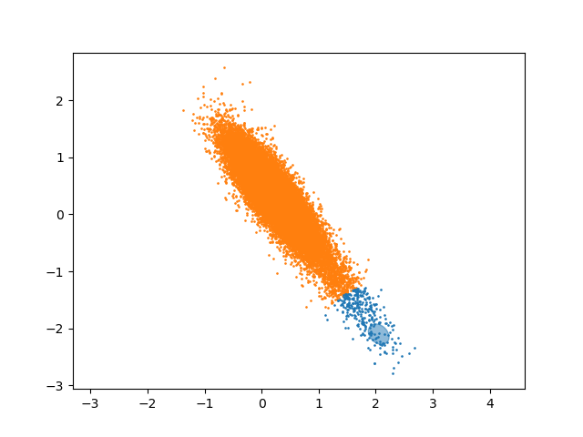

# Фреймворк активного обучения в cv

Вдохновленные концепциями Human-in-the-loop и Active Learning мы решили зафиксировать наш опыт по оптимизации разметки изображений в виде данного фреймворка. С помощью него вы сможете повысить качество модели, минимизируя затраты на разметку. Под петлей активного обучения, в которой участвует человек, мы понимаем следующую последовательность действий:

1. Разметка человеком первого сэмпла, изображения для которого выбираются рандомно.
2. Обучение модели.
3. Автоматизированная разметка неразмеченных изображений с помощью модели.
4. Выбор сэмплов для разметки с помощью методов неопределенности и разнообразия.
5. Разметка выбранных сэмплов человеком. Повторяем шаг 2 до тех пор, пока не получим приемлемое качество модели.

Сейчас реализованы только методы классификации. В будущем планируем добавить методы детекции.

По вопросам развитии проекта пишите Константину, его телеграм: @sky_1978

## Установка

1. Установите [git](https://github.com/git-guides/install-git)
2. Скопируйте проект: `git clone https://github.com/Kommunarus/docker_al_v1`
3. Установите [docker-compose](https://docs.docker.com/compose/install/other/)
4. Разверните контейнер: `docker-compose up -d`, изменив предварительно путь в файле docker-compose.yaml:

   
5. Для тестов установите [Postman](https://www.postman.com/downloads/)

## Требования

Наличие ГПУ на хосте. Алгоритмы обучают нейросети.

## Быстрый старт

После разворачивания контейнера, запустится вебсервис по адресу 127.0.0.1:5000

#### Функция active_learning.

Основная функция, запускающая поиск сэмплов для разметки.

|   | параметр | описание                                                                                                                                                                                      |
| - | ---------------- | ----------------------------------------------------------------------------------------------------------------------------------------------------------------------------------------------------- |
| 1 | backbone         | эмбединги какой сети будут использоваться для классификации изображений. Возможные значения: b0, resnet50, mobilenet |
| 2 | add              | количество сэмплов, которые нужно найти для разметки                                                                                                     |
| 3 | method           | метод активного обучения для поиска сэмплов. Возможные значения: margin, least, ratio, entropy, vae, mixture                                   |
| 4 | path_to_labels   | путь до файла/папки с разметками                                                                                                                                           |
| 5 | path_to_img      | путь до папки с изображениями                                                                                                                                                |

Пример:

Результат: неразмеченные изображения, которые были выбраны как наиболее значимые для разметки

path_to_labels может быть как папкой, так и файлом. Файлы должны быть следующего формата: имя_файла\tкласс\n

125937.jpg\t0\n
178223.jpg\t0\n
064001.jpg\t1\n
136649.jpg\t2\n

***method*** делятся на методы неопределенности и методы разнообразия.

**Методы неопределенности**:

least, margin, ratio, entropy

**Методы разнообразия**:

vae — метод на основе вариационного кодировщика. Размеченный датасет обучает сеть восстанавливать изображения без ошибок. Неразмеченные изображения ранжируются по ошибке восстановления. Если изображение восстанавливается с большой ошибкой, значит похожей не было в обучаемом датасете, она сильно не похожа на известный размеченный датасет. Такие изображения - кандидаты для разметки.

mixture — размеченный датасет обучает сиамскую сеть для кодирования эмбедингов изображений (размерностью 2) так, что бы разные классы не соприкасались. После, методом кластеризации Gaussian Mixture эмбединги размеченных изображений делятся на кластера и предсказываем класс неразмеченных. Из каждого кластера выбираются сэмплы.

Методы разнообразия лучше использовать, когда классов не очень много.

#### Функция f1

Используется для валидации. Сеть определяется backbone-ом.

|   | параметр     | описание                                                                                                                                                            |
| - | -------------------- | --------------------------------------------------------------------------------------------------------------------------------------------------------------------------- |
| 1 | backbone             | тоже , что и в active_learning                                                                                                                                     |
| 2 | path_to_labels_train | путь до файла/папки с разметками для обучения простого классификатора                                           |
| 3 | path_to_img_train    | путь до папки с изображениями для обучения простого классификатора                                                |
| 4 | path_to_labels_val   | путь до файла/папки с разметками, по которой будем определять точность работы классификатора |
| 5 | path_to_img_val      | путь до папки с изобажениями, по которой будем определять точность работы классификатора        |

Пример:

Результат:

Структура папки ds_for_docker:

## Будущее

Реализовать методы Object detection.
